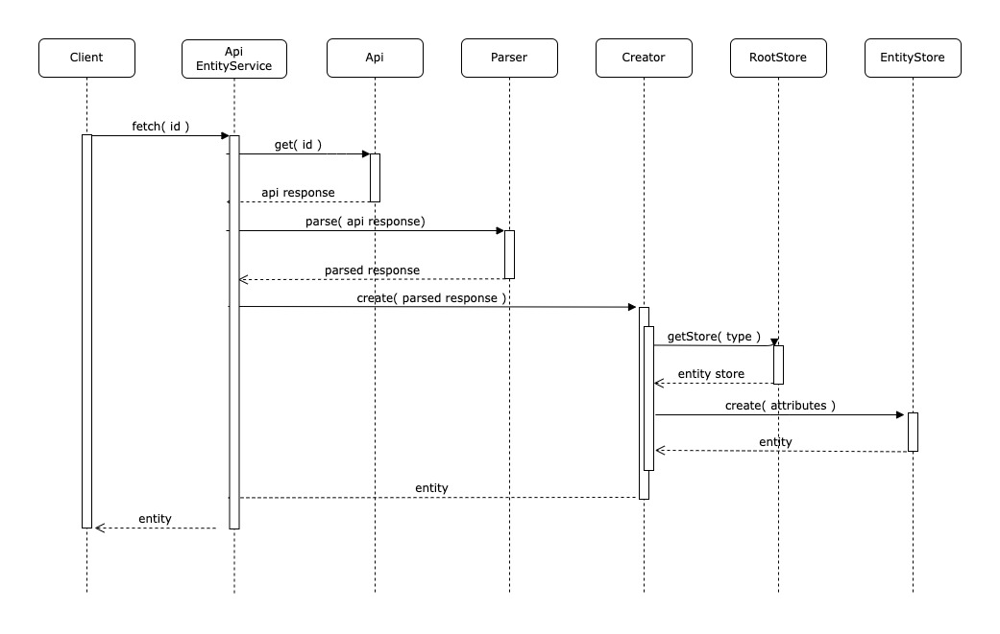

# Usage

The main class of this package is the `ApiEntityService` class which provides an abstraction for an REST Api resource. This class depends on 3 other services:
- The `api client` in charge of making the http requests to the remote REST API.
- The `parser` in charge of parsing the response received from the remote REST API.
- The `error parser` in charge of parsing the failed responses from the remote REST API.
- The `creator` in charge of creating the entities and their relationships in their corresponding stores.

Here you have an example of how these classes interact with each other when calling the `fetch` method in the `ApiEntityService`:



## Complete Example

Here is a complete example using the `HTTPApiClient` from the [@amalgama/http-api-client package](https://git.amalgama.co/amalgama/packages/npm/http-api-client) as the `API` and the `StoreEntity` and `EntityStore` classes from the [@amalgama/entity-store package](https://git.amalgama.co/amalgama/packages/npm/entity-store) to define the entities stores for the root store.

__User entity__
```ts
// entities/User.ts
import { StoreEntity, IRootStore } from '@amalgama/entity-store';
import { makeObservable, observable } from 'mobx';

export interface UserAttributes{
	id: number
	firstName: string
	lastName: string
}

export interface UserSerialization {
	id: number
	first_name: string
	last_name: string
}

export default class User extends StoreEntity {
	id: number;
	firstName: string;
        lastName: string;

	constructor( attributes: UserAttributes, rootStore?: IRootStore ) {
		super( rootStore );

		this.id = attributes.id;
		this.firstName = attributes.firstName;
		this.lastName = attributes.lastName;

		makeObservable( this, {
			id: observable,
			firstName: observable,
			lastName: observable
		} );
	}

	updateWith( other: User ): User {
		this.firstName = other.firstName;
		this.lastName = other.lastName;

		return this;
	}

	toJSON(): UserSerialization {
		return {
			id: this.id,
			first_name: this.firstName,
			last_name: this.lastName
		};
	}

	static fromJSON( attributes: UserSerialization, rootStore?: IRootStore ): User {
		return new User( {
			id: attributes.id,
			firstName: attributes.first_name,
			lastName: attributes.last_name
		}, rootStore );
	}
}
```

__Tag entity__
```ts
// entities/Tag.ts
import { StoreEntity, IRootStore } from '@amalgama/entity-store';
import { makeObservable, observable } from 'mobx';

export interface TagAttributes{
	id: number
	label: string
}

export interface TagSerialization {
	id: number
	label: string
}

export default class Tag extends StoreEntity {
	id: number;
	label: string;

	constructor( attributes: TagAttributes, rootStore?: IRootStore ) {
		super( rootStore );

		this.id = attributes.id;
		this.label = attributes.label;

		makeObservable( this, {
			id: observable,
			label: observable
		} );
	}

	updateWith( other: Tag ): Tag {
		this.label = other.label;

		return this;
	}

	toJSON(): TagSerialization {
		return {
			id: this.id,
			label: this.label
		};
	}

	static fromJSON( attributes: TagSerialization, rootStore?: IRootStore ): Tag {
		return new Tag( {
			id: attributes.id,
			label: attributes.label
		}, rootStore );
	}
}
```

__Post entity__
```ts
// entities/User.ts
import { StoreEntity, IRootStore, belongsTo, hasMany } from '@amalgama/entity-store';
import { makeObservable, observable } from 'mobx';
import User from '../User';
import Tag from '../Tag';

export interface PostAttributes{
	id: number
	title: string
	createdAt: string,
	authorId: number,
	tagsIds: number[]
}

export interface PostSerialization {
	id: number,
	title: string,
	created_at: string,
	author_id: number,
	tags_ids: number[]
}

export default class Post extends StoreEntity {
	id: number
	title: string
	createdAt: string
	authorId: string
	tagsIds: number[]

	@belongsTo( 'usersStore', 'authorId' )
	author?: User;

	@hasMany( 'tagsStore', 'tagsIds' )
	tags!: Tag[];

	constructor( attributes: PostAttributes, rootStore?: IRootStore ) {
		super( rootStore );

		this.id = attributes.id;
		this.title = attributes.title;
		this.createdAt = attributes.createdAt;
		this.authorId = attributes.authorId;
		this.tagsIds = attributes.tagsIds;

		makeObservable( this, {
			id: observable,
			title: observable,
			createdAt: observable,
			authorId: observable,
			tagsIds: observable,
			author: computed,
			tags: computed
		} );
	}

	updateWith( other: Post ): Post {
		this.id = other.id;
		this.title = other.title;
		this.createdAt = other.createdAt;
		this.authorId = other.authorId;
		this.tagsIds = other.tagsIds;

		return this;
	}

	toJSON(): PostSerialization {
		return {
			id: this.id,
			title: this.title,
			created_at: this.createdAt,
			author_id: this.authorId,
			tags_ids: this.tagsIds
		};
	}

	static fromJSON( attributes: PostSerialization, rootStore?: IRootStore ): Post {
		return new Post( {
			id: attributes.id,
			title: attributes.title,
			createdAt: attributes.created_at,
			authorId: attributes.author_id,
			tagsIds: attributes.tags_ids
		}, rootStore );
	}
}
```

__RootStore__
```ts
import type { AttrsType, EntityStore } from '@amalgama/entity-store';
import type { IRootStore } from '@amalgama/api-entity-service';
import User, { UserAttributes } from 'entities/User';
import Tag, { TagAttributes } from 'entities/Tag';
import Post, { PostAttributes } from 'entities/Post';

type UserStore = EntityStore<User, UserAttributes>;
type TagStore = EntityStore<Tag, TagAttributes>;
type PostStore = EntityStore<Post, PostAttributes>;

export default class RootStore implements IRootStore {
	usersStore: UserStore;
	tagsStore: TagStore;
	postsStore: PostStore;

	constructor() {
		this.usersStore = new EntityStore<User, UserAttributes>( User, this );
		this.tagsStore  = new EntityStore<Tag, TagAttributes>( Tag, this );
		this.postsStore = new EntityStore<Post, PostAttributes>( Post, this );
	}

	getStore<T>( type: string ): IEntityStore<T> {
		const STORES_BY_TYPE = {
			user: this.usersStore,
			tag: this.tagsStore,
			post: this.postsStore
		};

		const store = STORES_BY_TYPE[ type ];
		if ( !store ) { throw new Error( `There is not store defined for type ${type}` ); }

		return store as IEntityStore<T>;
	}
}
```

__ApiParser__
```ts
const POST_MAPPER = {
	id: 'id',
	title: 'title',
	created_at: 'createdAt',
	author_id: 'authorId',
	tags_ids: 'tagsIds'
};

const USER_MAPPER = {
	id: 'id',
	first_name: 'firstName',
	last_name: 'lastName'
};

const TAG_MAPPER = {
	id: 'id',
	label: 'label'
};

export default new JSONApiParser( { post: POST_MAPPER, user: USER_MAPPER, tag: TAG_MAPPER } );
```

__Api Response: GET https://test-api.amalgama.co/v1/posts__
```json
{
	data: [
		{
			id: 28,
			type: 'post',
			attributes: {
				title: 'Other post',
				created_at: '04/23/2022'
			},
			relationships: {
				author: {
					data: { id: 3 },
					type: 'user'
				},
				tags: [
					{
						data: { id: 3 },
						type: 'tag'
					},
					{
						data: { id: 4 },
						type: 'tag'
					}
				]
			}
		},
		{
			id: 13,
			type: 'post',
			attributes: {
				title: 'My first post',
				created_at: '02/29/2022'
			},
			relationships: {
				author: {
					data: { id: 3 },
					type: 'user'
				},
				tags: [
					{
						data: { id: 5 },
						type: 'tag'
					}
				]
			}
		},
		{
			id: 5,
			type: 'post',
			attributes: {
				title: 'Awesome Post',
				created_at: '05/10/2019'
			},
			relationships: {
				author: {
					data: { id: 5 },
					type: 'user'
				},
				tags: [
					{
						data: { id: 3 },
						type: 'tag'
					},
					{
						data: { id: 7 },
						type: 'tag'
					}
				]
			}
		},
	]
	included: [
		{
			id: 3,
			type: 'user',
			attributes: {
				first_name: 'Joe',
				last_name: 'Doe',
			}
		},
		{
			id: 5,
			type: 'user',
			attributes: {
				first_name: 'Jane',
				last_name: 'Doe',
			}
		},
		{
			id: 3,
			type: 'tag',
			attributes: {
				labe: 'Tech'
			}
		},
		{
			id: 4,
			type: 'tag',
			attributes: {
				labe: 'Software'
			}
		},
		{
			id: 5,
			type: 'tag',
			attributes: {
				labe: 'IOT'
			}
		},
		{
			id: 7,
			type: 'tag',
			attributes: {
				labe: 'Innovation'
			}
		}
	]
}
```

__PostsService__
```ts
import { Api } from '@amalgama/http-api-client';
import {
	EntityCreator, JSONApiErrorParser, ApiEntityService
} from '@amalgama/api-entity-service';

import RootStore from 'stores/RootStore';
import ApiParser from 'services/ApiParser';

const api = new Api( 'https://test-api.amalgama.co' );
const basePath = 'v1/posts';
const rootStore = new RootStore();
const errorParser = new JSONApiErrorParser();
const creator = new EntityCreator( { rootStore } );

const postsService = new ApiEntityService( {
	api,
	parser: ApiParser,
	creator,
	basePath,
	errorParser
})

const posts = postsService.fetchAll( { page: 2, page_size: 3, order: 'created_at:desc' } );
// [
// 	Post( {
// 		id: 28,
// 		title: 'Other post',
// 		createdAt: '04/23/2022',
// 		authorId: 3,
// 		tagsIds: [ 3, 4 ]
// 	} ),
// 	Post( {
// 		id: 13,
// 		title: 'My first post',
// 		createdAt: '02/29/2022',
// 		authorId: 3,
// 		tagsIds: [ 5 ]
// 	} ),
// 	Post( {
// 		id: 5,
// 		title: 'Awesome post',
// 		createdAt: '05/10/2019',
// 		authorId: 5,
// 		tagsIds: [ 3, 7 ]
// 	} )
// ]

posts[ 0 ]
// Post( {
// 	id: 28,
// 	title: 'Other post',
// 	createdAt: '04/23/2022',
// 	authorId: 3,
// 	tagsIds: [ 3, 4 ]
// } )

posts[ 0 ].author
// User( {
// 	id: 3,
// 	firstName: 'Joe',
// 	lastName: 'Doe'
// } )

posts[ 0 ].tags
// [
// 	Tag( {
// 		id: 3,
// 		label: 'Tech'
// 	} ),
// 	Tag( {
// 		id: 4,
// 		label: 'Software'
// 	} )
// ]
```